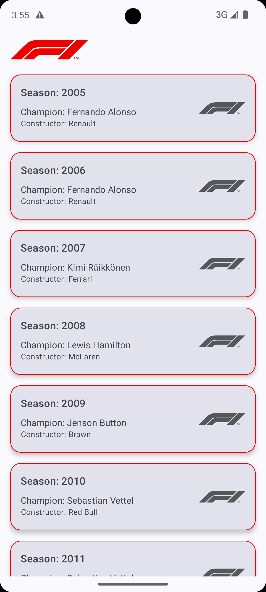
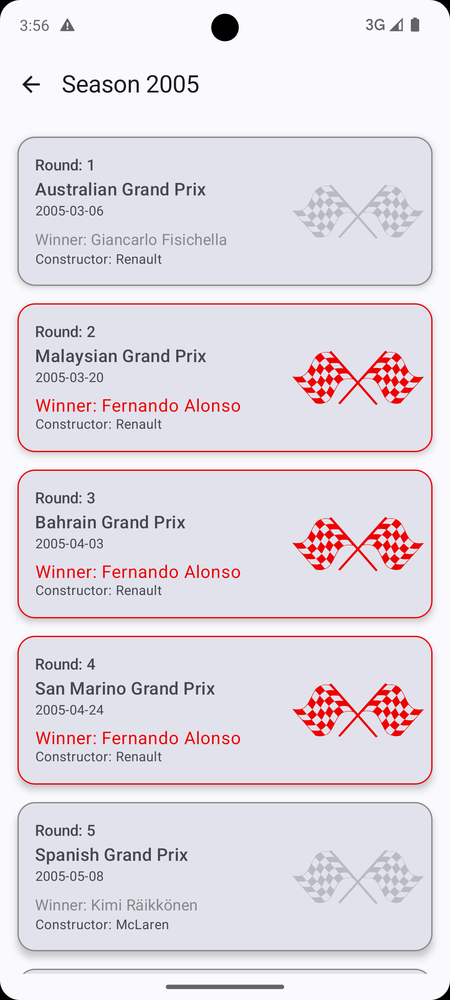

# F1 Champions Fullstack App 🏁

A fullstack Kotlin application that displays Formula 1 World Champions and their season details.

- 📱 **Android App**: Jetpack Compose + Hilt + Retrofit
- ☁️ **Backend**: Kotlin Spring Boot (WebFlux, Redis, PostgreSQL)
- 🐳 **Infrastructure**: Dockerized with Prometheus, PGAdmin, GitHub Actions CI/CD

---

## 🧠 Architecture Overview

The system is composed of:

- **Frontend** (Native Android) structured for modularity and scalable growth.
- **Backend** (Spring Boot WebFlux) with a clean architecture approach.
- **Shared CI/CD** pipelines per app for linting, testing, analysis, and releases.
- **Dockerized backend** setup for consistent local development and observability.

---

## 🖼️ Android UI Preview

Below are a few screens captured from the running Android application:

<p float="left">
  
  
  
</p>

---

## ⚖️ Trade-Offs Considered

### 📱 Android

### 🤖 Android Architecture – Trade-off Analysis

| Area                      | Chosen Option                  | Alternatives Considered     | Trade-offs                                                                 |
|---------------------------|--------------------------------|-----------------------------|----------------------------------------------------------------------------|
| UI Toolkit                | **Jetpack Compose**            | XML-based Views             | Enables declarative UI and real-time previews, but requires learning new patterns and APIs. |
| State Management Pattern  | **MVI (Model–View–Intent)**    | MVVM                        | Provides predictable state flow and easier debugging, but increases boilerplate and complexity compared to MVVM. |
| State Holder              | **`mutableStateOf`**           | `StateFlow`, `LiveData`     | Simple and Compose-native, but less suitable for shared or lifecycle-aware state across layers. |
| Project Structure         | **Single module, feature-based** | Multi-module setup         | Keeps things simple for now while allowing future scalability, but lacks strict encapsulation between features. |
| Dependency Injection      | **Hilt**                       | Koin                        | Compile-time safety, strong AndroidX support, and better tooling, but requires more setup and boilerplate annotations. |


### ☁️ Backend

| Area                      | Chosen Option             | Alternatives Considered      | Trade-offs                                                                 |
|---------------------------|---------------------------|-------------------------------|----------------------------------------------------------------------------|
| Web Layer                 | **Spring WebFlux**        | Spring MVC                    | Offers non-blocking I/O and scalability for async APIs, but comes with a steeper learning curve and more complex debugging. |
| Caching Strategy          | **Manual eviction**       | TTL-based expiration          | Provides precise control to prevent stale but “valid” data; however, it increases implementation complexity and maintenance effort. |
| Logging                   | **Prefixed structured logging** | Plain or unstructured logging | Improves log traceability across services; setup is slightly more verbose and requires consistent tagging. |
| Observability             | **Micrometer + Prometheus** | Custom metrics     | Open-source, flexible, and integrates well with Spring, but requires hosting Grafana and maintaining Prometheus infrastructure. |
| Deployment & Environments| **Dockerized infrastructure** | Manual local setup, cloud-native tools | Ensures environment parity and simplifies onboarding, but adds overhead for simple setups and requires familiarity with Docker. |

---

### 🌱 Seeding Strategy

On application startup, the backend triggers a seeding process that:
- Fetches all champions from 2005 to the current year
- Queries season details for each champion
- Saves the results into PostgreSQL
- Uses a custom orchestrator to coordinate this flow

This ensures a performant, API-call-free experience during normal operation.

---

## 📡 External Data Source

The backend fetches racing data from the public [Jolpi Ergast API](https://api.jolpi.ca/ergast/), a wrapper around the Ergast Developer API.

This external API provides detailed information about:
- F1 champions per season
- Race wins, rounds, and constructor details

---

## 🚀 Running the Project

### 🔧 Build Backend

```bash
cd backend
./gradlew build
```

### 🐳 Run via Docker

Before running the backend stack, make sure you **create a `.env` file** at:

```
infrastructure/backend/.env
```

See the [Environment Variables](#-environment-variables) section.

Then run the full backend setup using:

```bash
docker compose \
  -f infrastructure/backend/.docker/docker-compose.yml \
  --env-file infrastructure/backend/.env \
  up --build -d
```

> This will launch PostgreSQL, Redis, Prometheus, Grafana, PgAdmin, and your Spring Boot app.


### 📱 Run Android App

1. Open `frontend/f1-champions-frontend` in Android Studio.
2. Run `F1Application`.
3. For emulator base URL: `http://10.0.2.2:8080`

---

## ✅ Run Tests

```bash
cd backend && ./gradlew test
cd frontend && ./gradlew app:testDebugUnitTest
```

---

## 🔁 CI/CD Pipeline (GitHub Actions)

The project includes robust CI/CD pipelines triggered on:

- Push to `master`
- Pull requests targeting `master`

### CI Stages

#### Android:
- ✅ Setup (Gradle, JDK, Android SDK)
- ✅ Lint
- ✅ Unit Tests
- ✅ Build APK
- ✅ CodeQL Security Scan
- ✅ GitHub Release Upload (APK)

#### Backend:
- ✅ Setup (Gradle, JDK, Dockerized PostgreSQL)
- ✅ Lint (Spotless)
- ✅ Unit Tests
- ✅ Build JAR
- ✅ CodeQL Security Scan
- ✅ GitHub Release Upload (JAR)
- ✅ Docker Image Build & Push to GHCR

> CodeQL scans also run on a weekly schedule for both Android and backend.

---

## 📦 Releases

Built artifacts are automatically uploaded to the **GitHub Releases** tab after each successful build on `master`.

- 📱 **Android APKs**: Named `f1champions-debug-v1.0.X.apk`
- ☁️ **Backend JARs**: Named `f1-champions-v1.0.X.jar`
- 🐳 **Docker Images**: Pushed to `ghcr.io/aelkhami/f1-champions`

You can always grab the latest artifacts from the [Releases](https://github.com/aelkhami/F1-Champions-fullstack/releases) page.

---

## 📜 API Contract

> Available at `http://localhost:8080/swagger-ui.html`

### 🔹 `GET /f1/champions`

Returns all available world champions.

**Sample Response:**
```json
[
  {
    "season": "2023",
    "driverName": "Max Verstappen",
    "constructor": "Red Bull Racing"
  }
]
```

---

### 🔹 `GET /f1/champions/{season}`

Returns race wins for the champion of the given season.

**Sample Response:**
```json
[
  {
    "round": "7",
    "raceName": "Monaco Grand Prix",
    "date": "2023-05-28",
    "winnerName": "Max Verstappen",
    "constructor": "Red Bull Racing"
  }
]
```

---

## 📁 Folder Structure

```
F1-Champions-fullstack/
├── backend/
│   └── com/elkhami/f1champions/
│       ├── champions/
│       ├── seasondetails/
│       └── core/
├── frontend/
│   └── app/src/main/java/com/elkhami/f1champions/
│       ├── champions/
│       ├── seasondetails/
│       ├── core/
│       └── navigation/
├── infrastructure/
│   └── backend/.docker/
│       ├── docker-compose.yml
│       ├── Dockerfile
│       └── prometheus.yml
```

---

## 📈 Monitoring & Admin Setup

The backend is fully observable and debuggable using **Prometheus**, **Micrometer**, **Grafana**, and **PgAdmin**.

### 📊 Prometheus + Micrometer
- **Micrometer** exposes metrics at:  
  `http://localhost:8080/actuator/prometheus`
- **Prometheus** scrapes this endpoint and exposes a queryable UI at:  
  👉 `http://localhost:9090`
- Default metrics:
  - HTTP and WebFlux request stats
  - Redis hit/miss rates
  - JVM health metrics

### 📈 Grafana Dashboards
- Available at:  
  👉 `http://localhost:3000`
- Default login:  
  - Username: `admin`  
  - Password: `admin`
- To visualize:
  - Connect Prometheus as a data source (`http://prometheus:9090`)
  - Import dashboards or create panels for request latency, cache hits, etc.

### 🧑‍💻 PgAdmin (PostgreSQL UI)
- UI accessible at:  
  👉 `http://localhost:5050`
- Credentials (from `.env`):
  - Email: `admin@admin.com`
  - Password: `admin`
- Use it to inspect:
  - Seeded `champions` and `seasonDetails` tables
  - Database health or manual querying

---

## 🧾 Environment Variables

All services are configured using environment variables loaded from `.env`.

Here’s a reference:

```dotenv
# Database
POSTGRES_DB=f1db
POSTGRES_USER=postgres
POSTGRES_PASSWORD=mysecret

# PgAdmin
PGADMIN_EMAIL=admin@admin.com
PGADMIN_PASSWORD=admin

# Spring Boot App DB Access
DB_HOST=db
DB_PORT=5432
DB_NAME=f1db
DB_USERNAME=f1user
DB_PASSWORD=f1password
```


